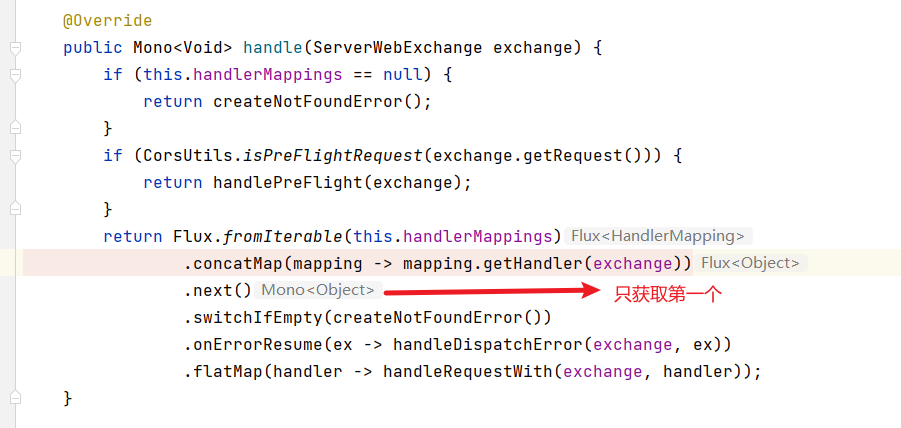

# swagger 访问地址
    /swagger.html ===> /webjars/swagger-ui/index.html

# DispatcherHandler
***完整路径：org.springframework.web.reactive.DispatcherHandler 主要的request分发器。在其handler()方法中可以追踪到request到底是被哪个HandlerMapping处理的。***

# HandlerMapping
***维护request与处理方法之间一个map，通过该类可以实现request与method方法之间的绑定，如controller中的方法与请求之间绑定。***

***在DispatcherHandler的handler方法中，发现RequestMappingHandlerMapping在RoutePredicateHandlerMapping前，且其处理链中使用了Flux.next()。那么一旦位置靠前的HandlerMapping匹配到方法时们就会导致后面的配置无效。***

.png)

# 路由存储
* <b>redis</b> 
***注意 路由通过redis存储时，使用自定义的ObjectMapper，
使用org.springframework.cloud.gateway.config.GatewayRedisAutoConfiguration#reactiveRedisRouteDefinitionTemplate初始化时，使用new ObjectMapper()配置***
